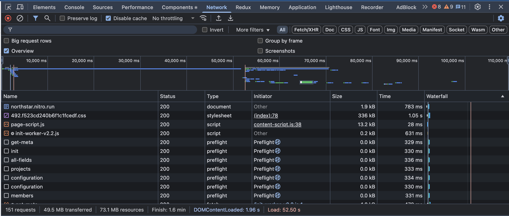

✋ Hi, I'm Chandrakumar
🛠️ Works at [Rocketlane](https://rocketlane.com/) as Lead Software Engineer

# I break apps so you don't have to

> Ways to measure and improve the performance of your applications!

🕸️ https://dreamerchandra.com/
💻 https://github.com/dreamerchandra
🛝 [Slides @](https://github.com/dreamerchandra/react-talk)

̌

# 🥶📈😤 Real World
Today, we are going to dissect Rocketlane's app.

`Fair warning: This is not a beginner friendly talk.`

