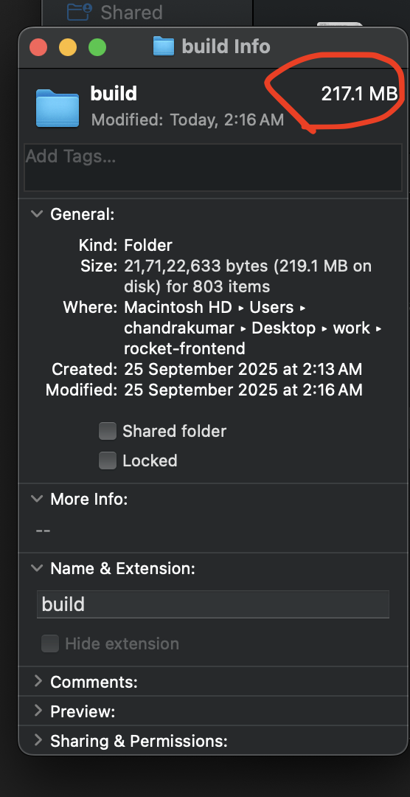
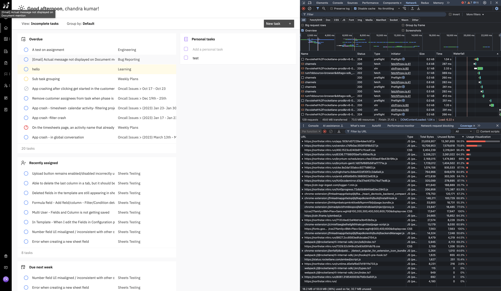
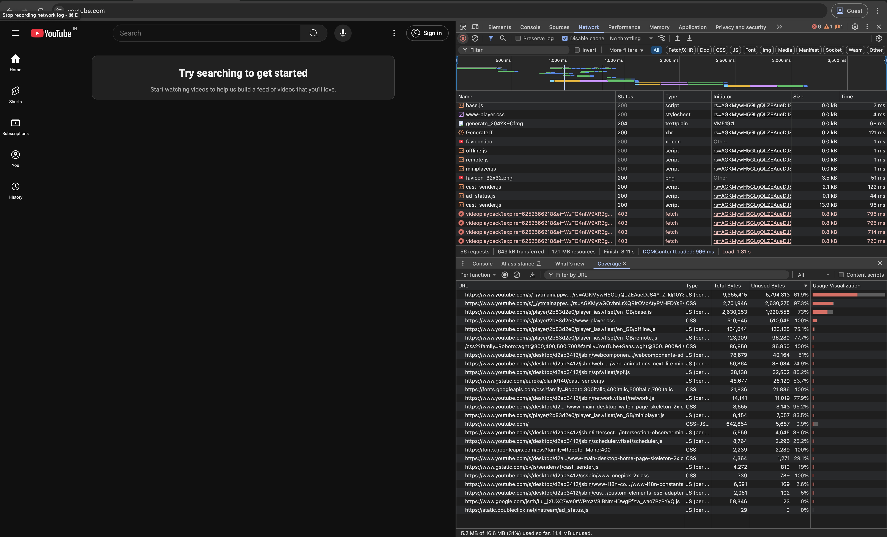
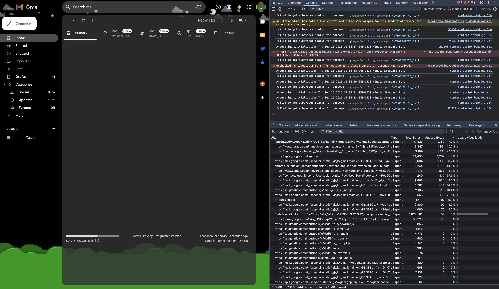

# WTF is LCP!

- Largest Contentful Paint (LCP) says when the web page is likely loaded
- It test your user's patience

# Website Problem

JS size: 47.6 MB 🤯
Used JS size: 17.1 MB (36%) 😳
Total API calls: 10 api calls 🫡

Math: 
> Download time @ 30Mbps: 12.7 sec
> Compile: 50ms/MB
> execute: 400ms/MB
> Compile time: 47.6 * 0.05 = 2.38 sec
> Execute time: 17.1 * 0.4 = 6.84 sec
> Total time: 12.7 + 2.38 + 6.84 = 21.92 sec
API calls should start at 21.92th sec.

User/Account Specific API calls: 3-5 sec.
> We have 7 such API calls. and our slowest API is 950ms
Redux setup is done at 25th sec.

Page Specific API calls: 5 sec.
> We have 3 such API calls. and our slowest API is 2.5 sec

To load the it takes ~40 sec. (on a good condition)

- How to fix it? (Hint: Don't lazy load everything)

# 🤓 Demo

- [What happens before LCP](3/simple-website.html)
- Performance tab
- Coverage tab

# 📝 Recap?

- 
- Roughly 50% of time is spent in compiling and executing JS. (450ms/MB)

# What's the trick!
- [Mock live](/mock-live/index.html)

- No overuse of lazy load, no waterfall
- Fetching APIs in web worker, while parallel download of JS
- Compile all JS in one go
- While JS is executing get the API response from worker thread
- 

# Our stats

JS size: 47.6 MB 🤯
Used JS size: 17.1 MB (36%) 😳
API calls: 17 api calls 🫡

Math: 
> Download time @ 30Mbps: 12.7 sec
> Compile: 50ms/MB
> execute: 400ms/MB
> Compile time: 47.6 * 0.05 = 2.38 sec
> Execute time: 17.1 * 0.4 = 6.84 sec
> Total time: 12.7 + 2.38 + 6.84 = 21.92 sec
API calls should start at 21.92th sec.

Our Slowest API is 950ms
Yutttttt LCP @ 21.92sec 🧐

If JS is cached, LCP @ 8-9 sec. 🥳

# Coverage benchmark 🎯

 

# Do and Don't
- 
- Use coverage tabs, to remove unused JS.
- SVG's probably in your main bundle. Lazy load it or change the format.
- webp < jpeg < png < (svg | gif)

- Shipping source maps doesn't affect performance but cost your CDN and CI/CD.
- Use web workers for heavy computations/API calls

- Use CDN to serve static assets and cache it
- Don't cache HTML itself.
- Use HTTPs/2

# 🤡 Don't get fooled by dev tools LCP

- LCP only tell half of the story. 
- Your users needs whole page to interacting; not just largest paint.
- [How to measure the full page when its loaded?](3/simple-website.html)

# Live Measurement
 - https://developer.chrome.com/docs/devtools/performance/extension
 - [Datadog](https://app.datadoghq.com/logs?query=%22page_response_time%22&agg_m=%40loadTime&agg_m_source=base&agg_q=%40userId&agg_q_source=base&agg_t=avg&analyticsOptions=%5B%22line%22%2C%22dog_classic%22%2Cnull%2Cnull%2C%22value%22%5D&clustering_pattern_field_path=message&cols=host%2Cservice&messageDisplay=inline&refresh_mode=sliding&sort_m=%40loadTime&sort_m_source=base&sort_t=avg&storage=hot&stream_sort=time%2Cdesc&top_n=50&top_o=top&viz=timeseries&x_missing=true&from_ts=1758539140522&to_ts=1758798340522&live=true)

# Recap
- Don't lazy load everything
- Use web workers for heavy computations/API calls
- Use coverage tab to remove unused JS
- Use CDN to serve static assets and cache it
- Measure real world performance and focus on app load time, not just LCP
